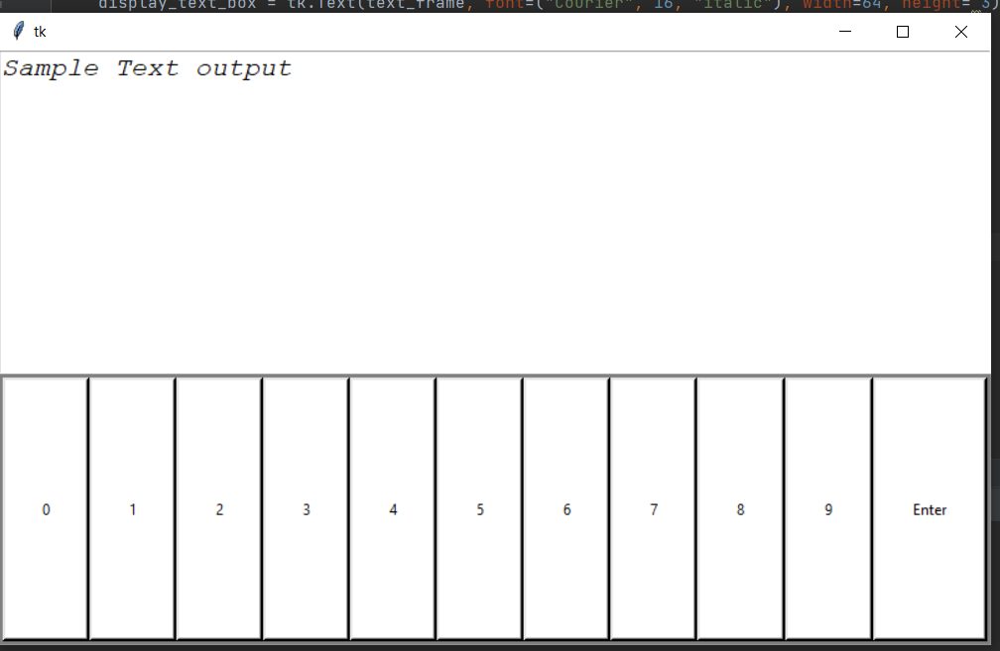

# Intro
GUI for the Debugger for I<sup>2</sup>c and UART device. Intended to work on raspberry pi. 

# Requirement
- python3
- tkinter (often come with python 3)

# How to use 
Just like how to run most python 3 programs.
 ```bash
 python3 main.py
 ```
Or in windows, click run.

# Changelog
8-4-2022
Initial version. Shows the simple layout. 

# File Description

```config.py```   Save the configuration values constants. Intend for fast config.

```main.py```     Main file. Display and control
