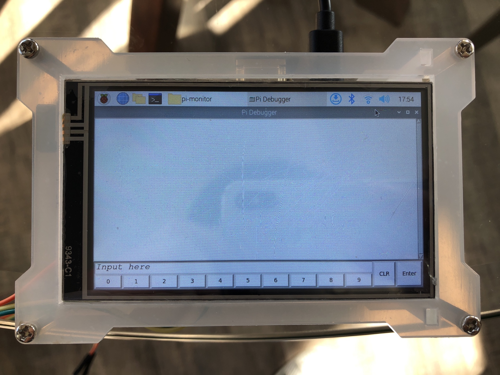
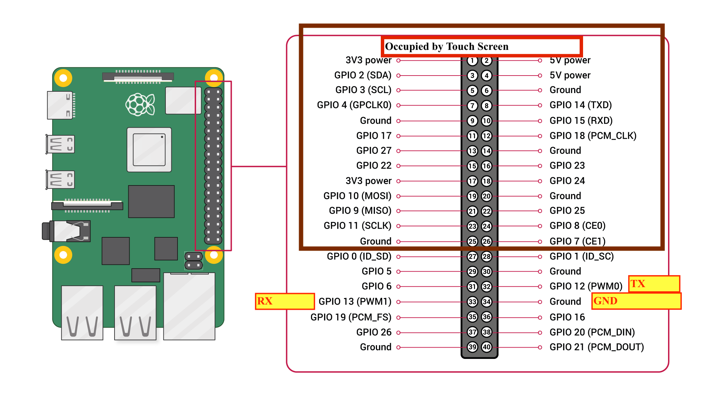

# Intro
GUI for the Debugger for I<sup>2</sup>c and UART device. Intended to work on raspberry pi. 

# Requirement
- python3
- tkinter (usually pre-installed with python 3 already)

# How to use 
## Wiring 

Connect 

GPIO12 <-> TX

GPIO13 <-> RX

and Ground to any Ground 
## Starting the program
Click ```run_pi.sh``` on Raspberry pi (may need to change permission first via chmod command), and in prompted window, click "excute"


Or terminal commands 
 ```bash
 python3 main.py
 ```
 
Or in windows, click run.

# Changelog
8-4-2022

Initial version. Shows the simple layout. 

8-12-2022

Finish UART. Improve interface. Add documentation

# File Description

```config.py```   Save the configuration values constants. Intend for fast config.

```main.py```     Main file. Display and control

